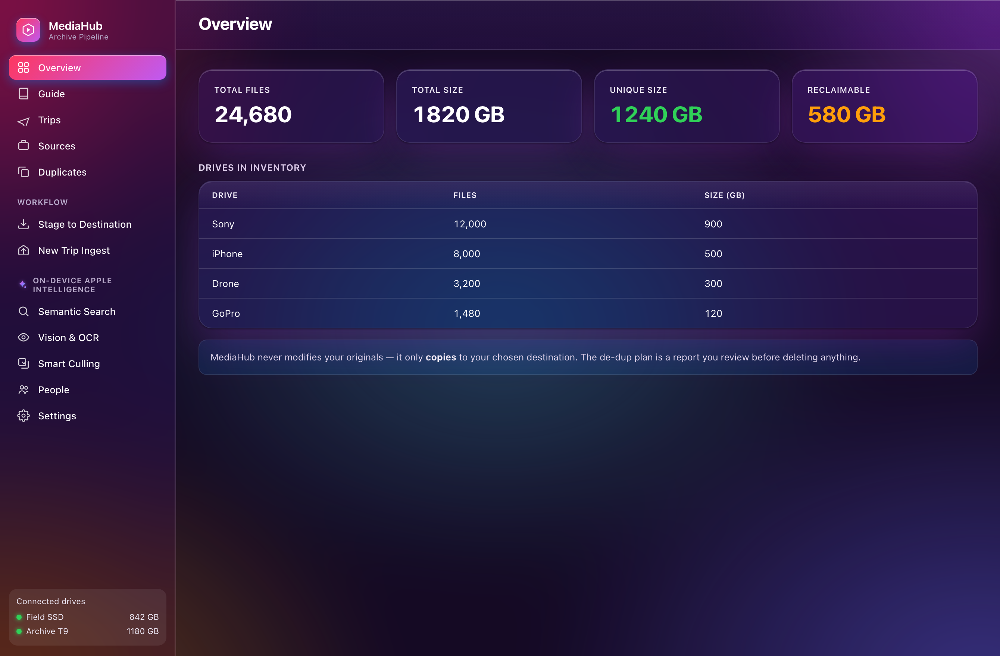
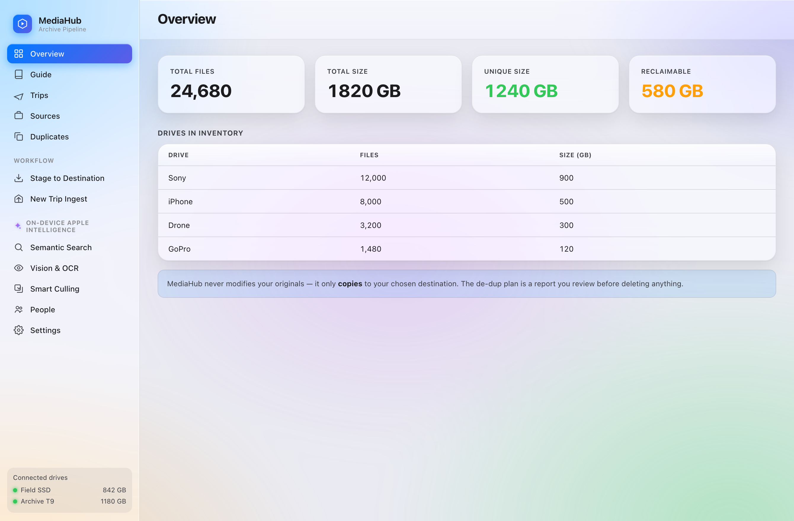
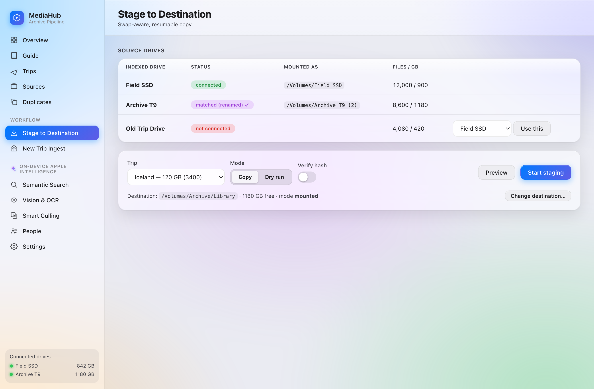
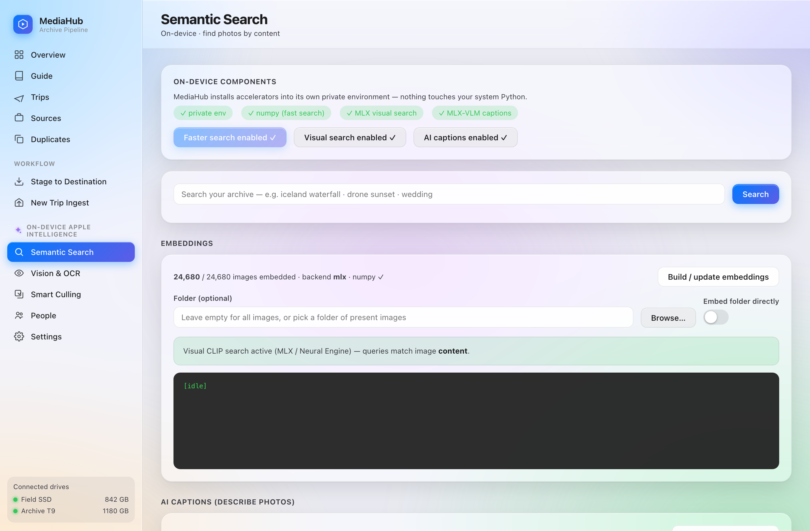

# MediaHub

A portable, **local-first macOS app** that turns a multi-terabyte photo/video archive
scattered across external SSDs into a clean, de-duplicated, searchable library on your
own SSD or NAS — safely, one trip at a time. It's the whole pipeline:

**Ingest → Index → De-duplicate → Organize by place/date/device → Stage (copy) to your SSD/NAS → Search & cull with on-device AI.**

The core runs on the **Python standard library only** — no Node, no Electron, no Docker,
no `pip` required. Optional AI accelerators install into a private virtual environment
the app manages for itself. The UI follows Apple's Human Interface Guidelines (glass
sidebar app, light/dark/Aurora themes), optionally wrapped in a native SwiftUI window.

> Deep architecture & rationale: see **[DESIGN.md](DESIGN.md)**.

## Screenshots

> Shown with placeholder demo data — not real library contents.



| Overview | Stage to Destination | Semantic Search (on-device) |
|---|---|---|
|  |  |  |

*Screenshots are generated from the real UI with fake data via
`python3 tools/make_screenshots.py` (headless Chrome) — no personal data.*

## Safety first

- Your original photos/videos are **never modified, moved, renamed, or deleted**.
- Staging only ever **copies** (`shutil.copy2`) to your chosen destination, with a
  crash-safe `.partial → verify → atomic rename` flow.
- De-dup and culling are **reports** you act on yourself — the app never deletes media.
- The inventory DB is read-only during normal use; the only writes are explicit
  **ingest** and **reconcile**, and reconcile uses a recoverable **Trash** (see below).

## Run it

**Double-click app (recommended):** open **`MediaHub.app`**. First launch: right-click →
**Open** (unsigned, so macOS asks once). The native shell (or your browser) opens to the
dashboard. If an instance is already running it reuses it; if a port is busy it walks to
the next free one.

**Script / module:**
```bash
cd ~/Desktop/MediaHub && python3 -m mediahub      # then open http://127.0.0.1:8765
```

**Database location:** MediaHub auto-finds `media_indexer.sqlite3` next to the package,
in `~/Library/Application Support/MediaHub/`, or in `~/Desktop/MediaIndexer_Package/`.
Override with `MEDIAHUB_DB=/path/to/media_indexer.sqlite3`.

Runtime state (settings, job state, trash, logs, manifests, AI side-DBs, the private
`pyenv/`) all live under `~/Library/Application Support/MediaHub/` — never in the repo or
app bundle, so the app can be read-only and updated without losing data.

## The core workflow — stage a trip

1. **Settings** → pick a **destination** (Local SSD or Mounted drive / NAS) with the
   folder **Browse…**, optionally enable **SHA-256 verify after copy**.
2. **Stage to Destination** → connect the source drive(s); the **Source drives** panel
   shows each as `connected`, `matched (renamed)`, `ambiguous`, or `not connected`.
3. Pick a trip → **Preview** the exact folder tree → **Dry run** (writes nothing) →
   **Copy** (confirm sheet). Quit/resume anytime.
4. If a needed drive isn't connected, MediaHub **pauses** and tells you which to attach.

### Two-drives-at-a-time? The swap-aware engine handles it
- Copies each unique file from **whichever drive is currently mounted**, so cross-drive
  duplicates rarely force a swap.
- **Drive identity** is resolved by name → learned UUID → content fingerprint → your
  choice, so a **renamed/remounted** drive still works.
- **Resumable & idempotent** via `stage_job.json`; already-verified files are skipped.
- **Errors & retry**: failed files are listed with reasons and retryable; every job
  writes `_MediaHub_manifest.{csv,json}`, `_MediaHub_errors.csv`, `_MediaHub_stage_summary.json`.

## NAS organization layout it produces

Place-first, then date, then original vs. edited, media kind, device, and finally
orientation (kept at the leaf so it never fragments the tree):

```
<destination>/<Location>/<Year>/<YYYY-MM>/
    raw|edited / images|videos / <Device> / {Horizontal,Vertical}
    _Sidecars/                  orphan sidecars only
    _MediaHub_manifest.csv (+ .json, errors.csv, stage_summary.json)
```

- `images` merges all stills (ARW/DNG/JPEG/HEIC); Sony/iPhone/GoPro/Insta360/Drone never mix.
- Year-Month from **EXIF capture date**. Functional sidecars (`.xmp/.aae/.srt`) ride
  with their media; regenerable proxies (`.thm/.lrf/.lrv/…`) and macOS junk are skipped.
- Device detection: EXIF make/model → extension → filename → `AbsoluteAltitude` (Drone).

## On-Device Apple Intelligence

All AI runs locally — nothing leaves your Mac. Enable engines once in
**Semantic Search → On-device components** (they install into MediaHub's **private venv**,
so your system Python is untouched; sidesteps PEP 668):

- **numpy** — faster search ranking.
- **MLX CLIP** (`mlx-clip`) — true **visual** search (match pixels, not filenames).
- **MLX-VLM** (`mlx-vlm`) — AI **photo captions** for full-text search.

Features (all report-only, with thumbnails + **Open** / **Reveal in Finder**):

| Tab | What it does |
|-----|--------------|
| **Semantic Search** | Find photos by content; natural-language queries (e.g. "drone shots 2024") auto-apply device/year filters. Stub backend = filename match; MLX = image content. |
| **Vision & OCR** | Apple Vision (Neural Engine) tags scenes + extracts **OCR text** from screenshots/documents; search the text inside images. |
| **AI captions** | Per-photo descriptions (stub from Vision+OCR, or real via MLX-VLM). |
| **People** | On-device face detection + clustering into private person groups. |
| **Smart Culling** | Finds near-duplicate/burst shots, suggests a best-shot to keep, exports a CSV plan. Never deletes. |

Vision/face tools build once via `swiftc` (needs Xcode CLT: `xcode-select --install`);
AI side-data lives in separate `*.sqlite3` files, never the inventory.

## New trips, deletes & keeping the DB honest

- **New Trip Ingest** → Browse a folder → **Scan & ingest** folds new media into the
  inventory (and a freshly-staged trip is auto-embedded for search).
- **Settings → Library maintenance → Scan for deleted files** reconciles the database
  when you delete files after backing up. It's **drive-aware** (only judges files on a
  *currently-mounted* drive as deleted) and moves them to a recoverable **Trash**
  (default 30-day window; restore or empty). A sidebar badge shows the count.
  Optional **Auto-reconcile on launch** toggle (off by default).

## Pairing with Immich (optional)

**Settings → Immich external library → Prepare for Immich** writes setup notes into your
destination so [Immich](https://immich.app) can read the organized folder *in place*
(read-only) for timeline/mobile/sharing. MediaHub stays the safe organizer; Immich is the
browsing layer.

## Appearance

**Settings → Appearance** — themes (Auto / Light / Midnight / refractive **Aurora glass**)
and accent color. Applies instantly, remembered across launches.

## Package layout

```
mediahub/        config · db · classify · settings · trips · dedupe · drives ·
                 staging · ingest · mounts · picker · applog · vision · search ·
                 captions · faces · ai · reindex · deps · server · __main__
mediahub/ui/     index.html · styles.css · app.js   (glass UI)
embed/           clip_embed.py   (stub | mlx CLIP embedder, RAW-aware)
vision/          vision_tag.swift + vision_enrich.py · face_detect.swift
shell/           MediaHubShell.swift (SwiftUI + WKWebView) · IconGen.swift · MediaHub.icns
```

Build artifacts (compiled Swift tools, generated icon PNG, the private `pyenv/`, all
runtime `*.sqlite3`/state) are git-ignored and regenerated on demand.

## Why not Docker?

Deliberately **native**: Apple Vision/Neural Engine don't exist in Docker's Linux VM;
drive hot-swap is unreliable through bind-mounts; multi-TB copies are slower; and there's
nothing to install anyway (stdlib core). A headless Linux build would only suit a
NAS-side, Vision-less scheduled service — a separate tool from this Mac workflow.

## Notes

- **Ingest** uses `exiftool` if installed (`brew install exiftool`) for richer metadata;
  without it, files are still indexed and device inferred from extension/filename.
- Trip grouping is keyword-based (`mediahub/classify.py`) with per-folder overrides.
- Every API response carries `X-App: MediaHub` (used for instance detection).
- Logs: `~/Library/Application Support/MediaHub/logs/` (exportable from Settings).
